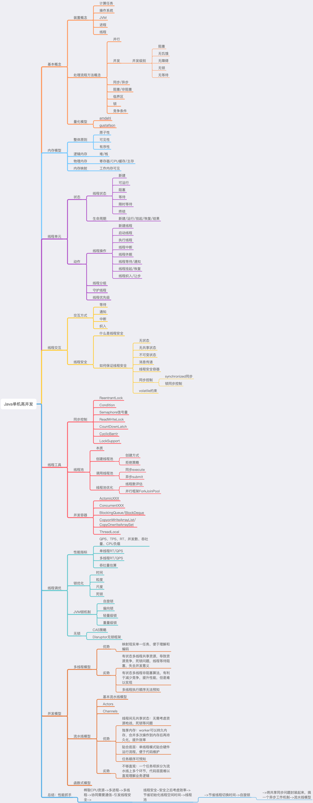

# java单机高并发

### 1.顶层全貌思维
最近学习发现，站在顶层视角去看待问题有助于我们更快地把握知识脉络，将知识填充到技能树里，应用于生产。内化为自己的知识背景，从而让我们更得心应手地解决更多的生产问题，完成系统目标。甚至创造新的发明。顶层思维也就要求我们程序员要懂架构的起源，顶层结构的全貌。要时刻把自己当做架构师。
### 2.由果索引
在学习一个新知识点的时候，摆在我们面前的是一个成型的体系，是一个现象。那么我们只进行填鸭式的补充，大脑将会很快忘记，这不能帮我们提升解决问题的能力，也无法串联到学科知识里。多问题几个问什么？从不同的角度多问几个为什么？JVM本质上是什么？是一个进程。为什么会有进程的概念？啊因为要提升系统的吞吐量进而缩短执行整体任务的时间也就是提升性能。为什么是进程要设计成这样？这对于CPU + 内存结构的计算机而言有什么可以利用的优势?为什么操作系统要设计成分时的？当然也要适可而止把握一个度，有了一个性能的抓手就好（关于性能抓手，参看我的一个小小思考），没必要在研究线程的时候非要先去搞明白分时操作系统的原理，暂且可以当做一个已有现象看待。要不然就会浪费时间，学习效率低下，下一次再去研究发现的不明白的知识就好。所以我一直提倡专题式学习也是有这部分考虑。
### 3.二者结合，“天下无敌”
而且有些知识点站在顶层去看，能容易想清楚它的来龙去脉，原因，作用，搞清楚它从哪来，它有什么用，它有哪些优点和缺陷，优点我怎么利用，缺点我怎么改进。 那么自然也就知道怎么去创新怎么去应用，怎么去解决问。剩下的就是编码了，于是你发现再也没有你不敢去学的知识。所谓天下无敌是当面临一个新的知识让你看到你是可以学会的。
     
好了，意识流梳理完了，就结合我说的意识流进入今天的正题，然后谈一下我自己的感悟。发现好多讲技术的文章和书籍，作者会倾囊相授知识点，也会将来龙去脉，往往可能忘记去讲自己怎么去理解这个东西。我从我自己一点点小的体会来聊这个事情，就是当我有了这种思维之后再去看线程和ThreadLocal的时候

### 术语定义：
整体任务：作为一个计算机的使用者，或者说客户端，或者服务的调用者，系统的调用者都行，我们希望计算机帮我们做一些事情，这些事情我们称之为“任务”。但是由于CPU和内存、I/O、网络的速度有量级上的差异我们希望CPU在空闲时刻也能帮我们做计算。所以我们可以把我们的事情拆解为一个个可独立计算的任务。这些任务的总和，也就是前面说的我们要做的“事情”，我称之为总体任务，或者说任务集合。

### 线程
先说说线程,由性能这个抓手我们能理解到，线程是由进程演化而来，进程是由批处理任务演化而来，批处理任务是由原始需要手工输入的计算任务而来。线程进步到进程的意义在于我们（把我们自己当做操作系统）可以编排的任务粒度更小了，更灵活了，而且切换上下文带来的开销更小了，进程上下文切换带来的时间开销对于CPU来说太漫长了。而线程被执行的时候则不用切换进程上下文，切换线程上下文就好了。线程在物理上对应的就是栈里面的一段内存，存放着局部变量的空间和待执行指令集。当我有了顶层全貌思维之后，把我们自己当做操作系统，然后将JVM类比操作系统，本身JVM也是将操作系统的CPU+内存逻辑抽象成了堆栈结构。进程对线程的调度具体指JVM对线程的调度，犹如操作系统对进程的调度。为了更灵活高效地对任务进程编排完成整体任务，所以进程需要通信。之所以要灵活编排是因为各个进程执行任务的效率是不一样的，所以不同进程之间要协同。同样，线程演化为计算机执行单元的时候线程也需要通信。站在操作系统视角去看待线程组与线程的组织结构、线程被调度的场景、线程上下文切换的场景、为了节省初始化线程空间的时间而将线程放在栈里的线程池、以及单个线程执行的场景、是不是一部生生的画面已经在你脑海里了。这样CPU的计算能力可谓是被发挥地淋漓尽致了。这样看顺其自然我们还是为了性能，（并发本质上也是性能的提升，单位时间内能处理的请求，或者说能执行的任务更多了），才有了线程。
### 线程通信
然后我们需要解决线程间通信的问题，于是我们的前人，我们的大师们帮我们想了好多线程间的通信方式，他们适合不同的通信需要。如共享内存，消息队列，wait/notify,信号量。信号量本质上是为了将锁的范围扩大，可以允许同时几个线程访问临界区资源。wait/notify,信号量更像是JVM为了管理线程执行顺序赋予给线程“通过改变自身或者他人的状态的权利”的通信手段。共享内存和消息队列像是县城点真正传输数据的通信手段。线程通信同时也带来了更多的复杂度，有的通信方式需要共享内存，于是线程安全问题催生了。

###线程安全
事情都具有两面性，有利有弊，性能提升的同时也为我们带来了复杂度，比如我们要确保多线程并发的时候线程安全。

#### 什么是线程安全？

当多个线程访问同一个对象时，如果不用考虑这些线程在运行时环境下的调度和交替运行，也不需要进行额外的同步，或者在调用方进行任何其他的协调操作，调用这个对象的行为都可以获取正确的结果，那这个对象是线程安全的。（摘自《深入Java虚拟机》）

于是我们的前人大师们为我们想了好多方法来保证线程安全，比如ThreadLocal就是为了让线程间无状态共享，让线程本身自己去维护对象资源的声明周期（哈，站在大BOSSJVM的角度看是不是一下子就理解了ThreadLocal,这是我没有过的体验，学习了这么些年Java我竟然从没把ThreadLocal当做是JVM的一个功能，仅仅是JVM为了保障线程安全提供的一个全局的手段）。还比如抽象出临界区的概念，让线程互斥访问，防止共享数据出错。还有从sychronized到各种锁，本质上也是这个出发点。还比如可以使用volatile声明来使共享的主存跟每条线程的工作内存同步（每次读都从主存刷新，每次写完都刷到主存）除此之外，大师们还给我们写好了好多线程安全的数据结构，这在JDK里那些线程安全的包里可见一二。这让我们在编写线程安全的程序的时候省去不少事情。

好了，目前为止我想我对线程的意淫表达的已经差不多了，这里说的可能不完全正确，也可能不全面，但是没关系，但是我想足以表达我的意思了。

下面进入并发的正题，这里先给出知识导图，后续补充详细内容。有兴趣的读者可以先看这篇文章，高并发编程知识体系，写得很好。

本文知识梳理部分参考微信公众号文章：高并发编程知识体系
